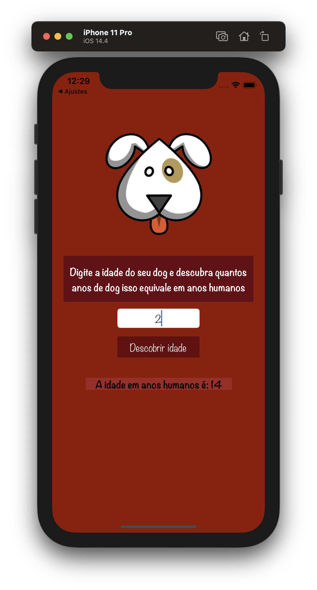

# idade-cachorro
Primeiro app do curso Desenvolvimento iOS 12

Estou fazendo o curso para entender um pouco melhor o básico de programação para iOS

Diferenças desse app para o app apresentado no curso:

- Cores
- Fonte
- Tratamento quando o `UITextField` está vazio

O que falta:

- [ ] Tratar quando usuário digita algo diferente de números no `UITextField`
  - Pode ser permitindo digitar somente números no `UITextField` (Ideal)
  - Ou de forma alternativa, tratar quando algo diferente de `Int` for digitado.

  
  
  

